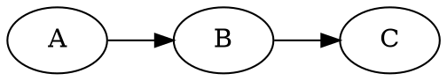

<p align="center">
  
</p>

# refract

Turn a small, readable **markdown** slide deck into
[RemoteCompose](https://developer.android.com/jetpack/androidx/releases/compose-remote)
slides you can play in the C++ desktop viewer or the TypeScript player.

```
slides.md ─► refract.py ─► component JSON (androidx format) ─► json2rc ─► .rc
```

refract emits the **androidx component JSON** format and lets the real `remote-core`
library serialize it — Python never touches the wire format, and layout is done by
the RemoteCompose engine via components, not pixel math.

## Quick start

```sh
python3 refract.py examples/deck               # writes examples/deck/out/*.rc
prebuilt/rcviewer examples/deck/out 1600 900   # play it (N/P to step, R to reload)
```

Requires Python ≥ 3.11 (stdlib `tomllib`). Graphs need `graphviz` (`dot`) on PATH.
`prebuilt/` ships ready-to-run `json2rc`, `rcviewer` and `rc2image`.

## Deck layout on disk

```
<deck>/
  slides.md          # the deck
  settings.toml      # optional per-deck settings (colors, size, transitions, shader…)
  shader.sksl        # optional background shader referenced from settings.toml
  includes/          # images, sub-decks, .rc / .json resources
  out/               # generated .rc files          (created)
  out/json/          # generated .json documents     (only with --json)
```

## Markdown grammar

```markdown
:: title : Nico
# refract
*Markdown to RemoteCompose*
<logo.png>

---

:: content [2:3] : Nico
# Two panes
- a point
  - a sub-point
- another

+++


```

- `---` on its own line separates slides (one `.rc` each).
- `:: <type> [flags] [@author] [: <speaker>] [ratio] [key=value…]` right after the
  separator sets slide metadata:
  - `@author` attributes the slide to an author from `[authors]` — the slide takes
    that author's colour as its accent and shows their name in the chrome. On an
    `include` it attributes every slide it pulls in (a slide's own `@author` wins).
  - `<speaker>` (after `:`) selects an accent colour from `[speakers]`.
  - `[ratio]` sets pane widths (see Panes); `key=value` are per-slide overrides
    (`bg`, `accent`, `shader=none`, `transition=push`…); bare-word `flags` include
    `fragment` (see Fragments).
- The first `# heading` is the title.
- An `*italic*` line right under the title is a **subtitle** (accent colour).
- Inline **`**bold**`**, *`*italic*`* and `` `code` `` work inside any text/bullet; a
  styled line wraps to the available width (word by word) and keeps a shared text
  **baseline** across mixed styles.
- Author names from `[authors]` are tinted with their colour wherever they appear in
  body text (e.g. the title-slide byline).
- A `???` line starts **speaker notes** — the rest of the slide goes to `out/notes.md`.
- Everything else is content **blocks**, in order.

### Slide types (`<type>`)

| Type      | Layout                                                        |
|-----------|---------------------------------------------------------------|
| `title`   | large title centered; an image renders above it (logo size)   |
| `section` | title centered (auto-numbered when an `agenda` slide exists)   |
| `content` | default — title at top, content below, left-aligned           |
| `include` | splice a sub-deck from `includes/<param>/slides.md` (or a `<section … will go there>` placeholder) |
| `agenda`  | replaced by an auto-generated table of contents of the `section` slides |

### Content blocks

| Block         | Markdown                                                       |
|---------------|---------------------------------------------------------------|
| text          | plain paragraphs                                              |
| subtitle      | `*italic*` line directly under the title                     |
| bullet list   | `- item`, indent two spaces per sub-level                     |
| table         | markdown pipe table `\| a \| b \|` (first row = header)      |
| code          | fenced ```` ``` ```` block — **syntax-highlighted** (kotlin, java, json) |
| graph         | fenced ```` ```dot ```` / `neato` / `fdp` / `circo` … — laid out by graphviz, drawn by refract (clusters, dashed/dotted/coloured edges, per-node colours) |
| chart         | fenced ```` ```chart-bar ```` / `chart-line` / `chart-pie` with `label: value` lines |
| image         | `<name.png>` (`.jpg/.gif/.webp`) — embedded **inline** in the `.rc` |
| code file     | `<name.kt>` (`.java/.py/.ts`) — the file rendered as a highlighted code block |
| video         | `<name.mp4>` (`.mov/.m4v`) — copied into `out/` as a slide the viewer plays |
| json include  | `<name.json>` — a RemoteCompose JSON document embedded **live** as components |
| rc include    | `<name.rc>` — live-embedded via its sibling `.json`; a lone `.rc` (no title) becomes a whole-slide passthrough |

Includes are resolved from `includes/`; the extension may be omitted (`<logo>`
finds `logo.png`). Speaker accent comes from `[speakers]` (below).

### Panes

Split a slide with `+++`; a ratio in the metadata sets the pane **widths** (height is
shared): `:: content [2:3]`, `:: [1:1]`, `:: [2:2:4]` — one number per pane.

## Transitions & "magic move"

`--transitions` (or `[transition] enabled = true`) animates each slide in from the
previous one on load. Styles (`[transition] style` or per-slide `transition=`):

- **fade** (default) — a `StateLayout` crossfade.
- **push** / **slide** — the previous slide slides out while the new one slides in
  (horizontal). Use **`slide-up`** (`push-up`) for a vertical move — the previous
  slide travels up and off while the new one rises from the bottom.
- **magic move** (automatic between two consecutive graph slides) — nodes matched by
  their dot identifier glide/resize to their new positions (snappy ease-out), edges
  morph along (resampled so their splines interpolate), and unmatched elements fade.

The first slide has **no in-transition** (nothing to come from) — it renders
statically and its *out* is animated by the next slide. So `:: section transition=slide-up`
on the slide after the title makes the title glide up as that slide rises in.

Push/slide **speed** is the slide time in seconds — set `[transition] duration` globally
or `transition_duration=` per slide (larger = slower), e.g.
`:: section transition=slide-up transition_duration=0.9`.

```sh
python3 refract.py examples/deck --transitions
```

### Fragments (progressive reveal)

Add the `fragment` flag to a slide to reveal its top-level bullets one at a time —
refract expands it into one slide per cumulative bullet:

```markdown
:: content fragment
# Build it up
- first
- second
- third
```

## settings.toml

```toml
[slide]
width     = 1600
height    = 900
title_gap = 44                  # vertical gap between title and content

[theme]
preset          = "dark"        # dark | light | midnight | warm | mono (applied first)
background      = "#FF141A2E"
title_color     = "#FFFFFFFF"
body_color      = "#FFE6EEF6"
accent          = "#FF4FC3F7"   # subtitles, table headers, emphasis
table_bg        = "#1AFFFFFF"
table_header_bg = "#22FFFFFF"

[chrome]                        # optional slide chrome (never shown on the title slide)
page     = true                 # "n / total" page number
footer   = "RemoteCompose · 2026"
progress = true                 # bottom progress bar
color    = "#66FFFFFF"

# Per-author colours. A slide/include marked "@Nico" takes that colour as its accent
# and shows the name in the chrome; names are also tinted wherever they appear in text.
# Full and short forms can both be listed (matched whole-word, longest first).
[authors]
"Nicolas Roard" = "#FF5CC8FF"
"Nico"          = "#FF5CC8FF"
"John Hoford"   = "#FFF6A96B"
"John"          = "#FFF6A96B"

# Per-speaker accent (":: content : Nico" → this colour for that slide).
[speakers]
Nico = "#FF4FC3F7"
John = "#FF81C995"
Yuri = "#FFFFB74D"

# Font sizes (px). Aliases: title (title-slide) / section / heading (content title) /
# body (content) / subtitle / table / code. Direct keys also work (content_body…).
[font]
heading  = 76
body     = 44
subtitle = 48
table    = 40

[image]
corner_radius = 28              # round embedded images

[code]
background    = "#FF1E1E1E"
foreground    = "#FFD4D4D4"
font_size     = 28
corner_radius = 18              # round the code panel
[code.syntax]                   # any subset; rest use defaults
keyword = "#FFC586C0"
type    = "#FF4EC9B0"
string  = "#FFCE9178"
number  = "#FFB5CEA8"
comment = "#FF6A9955"
key     = "#FF9CDCFE"           # JSON property names
literal = "#FF569CD6"           # true / false / null

[graph]
node_fill   = "#FF1B2A3D"
node_stroke = "#FF4FC3F7"
node_text   = "#FFE6EEF6"
edge        = "#FF89A7C2"

[shader]                        # animated background (SkSL)
file = "shader.sksl"            # or source = """...SkSL..."""
[shader.title]                  # optional per-slide-type override
file = "title.sksl"

[transition]
enabled = false                 # same as --transitions
style   = "fade"                # fade | push | slide | push-up
```

Precedence: **CLI flag > settings.toml > built-in default**. Any theme colour /
shader / accent can also be overridden per slide via `key=value` metadata
(e.g. `:: content bg=#FF101820 accent=#FFE8955A shader=none`).

### Background shaders

A slide background can be an animated SkSL shader (`iResolution`, `iTime` uniforms;
`iTime` is `animTime`, so it animates). It's drawn full-slide behind transparent
content. Different types can use different shaders via `[shader.<type>]`.

## CLI

```
python3 refract.py <deck> [options]
  --width / --height     slide size (default 1600×900 or settings.toml)
  --transitions          crossfade / push / graph magic move between slides
  --debug                1px red outline on every component
  --watch                regenerate on slides.md / settings / includes changes
  --pdf [PATH]           export the deck to a PDF (default <deck>/out/deck.pdf)
  --images [DIR]         export each slide to a PNG (default <deck>/out/images/)
  --json                 keep the intermediate JSON in out/json/ (default: discard)
  --json-only            emit JSON only; do not run json2rc
  --json2rc PATH         explicit json2rc launcher (default: auto-detect prebuilt)
```

Speaker notes (`???` blocks) are written to `<deck>/out/notes.md`.

## Prebuilt tools

- `prebuilt/json2rc` — JSON → `.rc` converter (built from the local androidx checkout;
  adds an `image` component that embeds a file inline)
- `prebuilt/rcviewer` — interactive C++ viewer (also `--pdf` / `--screenshot`)
- `prebuilt/rc2image` — headless `.rc` → PNG

## Architecture

Implementation lives in the `refractkit` package; `refract.py` is just the CLI.

| Module        | Responsibility                                            |
|---------------|-----------------------------------------------------------|
| `settings`    | load `settings.toml` (stdlib `tomllib`)                   |
| `theme`       | `Theme` (colors, fonts, code+syntax, chrome, shaders, presets) from settings |
| `markdown`    | slide markdown → `{meta, title, blocks, notes}`          |
| `deck`        | load `slides.md`, expand deck includes, resolve includes  |
| `components`  | low-level component builders (`text`, `dbg`)              |
| `inline`      | inline `**bold**` / `*italic*` / `` `code` `` → styled spans |
| `images`      | image dimensions + contained bitmap canvas (+ rounded clip) |
| `highlight`   | syntax highlighting — a language registry                 |
| `graph`       | graphviz layout → drawing (clusters/styles); magic-move geometry |
| `chart`       | bar / line / pie charts on a canvas                       |
| `render`      | blocks + theme → RemoteCompose component JSON             |

**Add a language:** drop a `tokenize_x` in `highlight.py` and register it in
`LANGUAGES`. **Restyle:** edit `settings.toml`. **Change the background:** edit the
`.sksl`.

## Tests

```sh
python3 -m unittest discover -s tests
```

## Notes

- Images embed **inline** (the C++ viewer only renders inline images, not URL/file refs).
- A binary `.rc` can't be spliced into a JSON tree, so live rc-embed uses the sibling
  `.json`.
- Graph magic move uses expression-interpolation (matched by dot id), which fits
  canvas-drawn graphs and needs no player changes.
