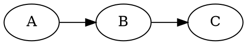

<p align="center">
  
</p>

# refract

Turn a small, readable **markdown** slide deck into
[RemoteCompose](https://developer.android.com/jetpack/androidx/releases/compose-remote)
slides you can play in the C++ desktop viewer or the TypeScript player.

```
slides.md ─► refract.py ─► component JSON (androidx format) ─► json2rc ─► .rc
```

refract emits the **androidx component JSON** format and lets the real `remote-core`
library serialize it — Python never touches the wire format, and layout is done by
the RemoteCompose engine via components, not pixel math.

## Quick start

```sh
python3 refract.py examples/deck               # writes examples/deck/out/*.rc
prebuilt/rcviewer examples/deck/out 1600 900   # play it (N/P to step, R to reload)
```

Requires Python ≥ 3.11 (stdlib `tomllib`). Graphs need `graphviz` (`dot`) on PATH.
`prebuilt/` ships ready-to-run `json2rc`, `rcviewer` and `rc2image`.

## Deck layout on disk

```
<deck>/
  slides.md          # the deck
  settings.toml      # optional per-deck settings (colors, size, transitions, shader…)
  shader.sksl        # optional background shader referenced from settings.toml
  includes/          # images, sub-decks, .rc / .json resources
  out/               # generated .rc files          (created)
  out/json/          # generated .json documents     (only with --json)
```

## Markdown grammar

```markdown
:: title
# refract
Markdown to RemoteCompose
<logo.png>

---

:: content [2:3]
# Two panes
- a point
- another

+++


```

- `---` on its own line separates slides (one `.rc` each).
- `:: <type> [: <params>] [ratio]` right after the separator sets slide metadata.
- The first `# heading` is the title; everything after is content **blocks**, in order.

### Slide types (`<type>`)

| Type      | Layout                                                        |
|-----------|---------------------------------------------------------------|
| `title`   | large title centered; an image renders above it (logo size)   |
| `section` | title centered                                                |
| `content` | default — title at top, content below, left-aligned           |
| `include` | splice a sub-deck from `includes/<param>/slides.md` (or a `<section … will go there>` placeholder) |

### Content blocks

| Block         | Markdown                                                       |
|---------------|---------------------------------------------------------------|
| text          | plain paragraphs                                              |
| bullet list   | `- item`, indent two spaces per sub-level                     |
| code          | fenced ```` ``` ```` block — **syntax-highlighted** (kotlin, json) |
| graph         | fenced ```` ```dot ```` / `neato` / `fdp` / `circo` … block — laid out by graphviz, drawn by refract |
| image         | `<name.png>` — embedded **inline** in the `.rc`               |
| json include  | `<name.json>` — a RemoteCompose JSON document embedded **live** as components |
| rc include    | `<name.rc>` — live-embedded via its sibling `.json`; a lone `.rc` (no title) becomes a whole-slide passthrough |

### Panes

Split a slide with `+++`; a ratio in the metadata sets the pane **widths** (height is
shared): `:: content [2:3]`, `:: [1:1]`, `:: [2:2:4]` — one number per pane.

## Transitions & "magic move"

`--transitions` (or `[transition] enabled = true`) wraps each slide in a `StateLayout`
that **crossfades** from the previous slide on load. When two consecutive slides are
graphs, refract instead emits a **magic move**: nodes matched by their dot identifier
glide/resize to their new positions (snappy ease-out), edges morph along (resampled so
their splines can interpolate), and unmatched nodes/edges fade.

```sh
python3 refract.py examples/deck --transitions
```

## settings.toml

```toml
[slide]
width = 1600
height = 900

[theme]
background   = "#FF141A2E"
title_color  = "#FFFFFFFF"
body_color   = "#FFE6EEF6"

[image]
corner_radius = 28              # round embedded images

[code]
background    = "#FF1E1E1E"
foreground    = "#FFD4D4D4"
font_size     = 28
corner_radius = 18              # round the code panel
[code.syntax]                   # any subset; rest use defaults
keyword = "#FFC586C0"
type    = "#FF4EC9B0"
string  = "#FFCE9178"
number  = "#FFB5CEA8"
comment = "#FF6A9955"
key     = "#FF9CDCFE"           # JSON property names
literal = "#FF569CD6"           # true / false / null

[graph]
node_fill = "#FF1B2A3D"
node_stroke = "#FF4FC3F7"
node_text = "#FFE6EEF6"
edge      = "#FF89A7C2"

[shader]                        # animated background (SkSL)
file = "shader.sksl"            # or source = """...SkSL..."""
[shader.title]                  # optional per-slide-type override
file = "title.sksl"

[transition]
enabled = false                 # same as --transitions
```

Precedence: **CLI flag > settings.toml > built-in default**.

### Background shaders

A slide background can be an animated SkSL shader (`iResolution`, `iTime` uniforms;
`iTime` is `animTime`, so it animates). It's drawn full-slide behind transparent
content. Different types can use different shaders via `[shader.<type>]`.

## CLI

```
python3 refract.py <deck> [options]
  --width / --height     slide size (default 1600×900 or settings.toml)
  --transitions          StateLayout crossfades / graph magic move
  --debug                1px red outline on every component
  --json                 keep the intermediate JSON in out/json/ (default: discard)
  --json-only            emit JSON only; do not run json2rc
  --json2rc PATH         explicit json2rc launcher (default: auto-detect prebuilt)
```

## Prebuilt tools

- `prebuilt/json2rc` — JSON → `.rc` converter (built from the local androidx checkout;
  adds an `image` component that embeds a file inline)
- `prebuilt/rcviewer` — interactive C++ viewer (also `--pdf` / `--screenshot`)
- `prebuilt/rc2image` — headless `.rc` → PNG

## Architecture

Implementation lives in the `refractkit` package; `refract.py` is just the CLI.

| Module        | Responsibility                                            |
|---------------|-----------------------------------------------------------|
| `settings`    | load `settings.toml` (stdlib `tomllib`)                   |
| `theme`       | `Theme` (colors, code + syntax, shaders) from settings    |
| `markdown`    | slide markdown → `{meta, title, blocks}`                  |
| `deck`        | load `slides.md`, expand deck includes, resolve includes  |
| `components`  | low-level component builders (`text`, `dbg`)              |
| `images`      | image dimensions + contained bitmap canvas (+ rounded clip) |
| `highlight`   | syntax highlighting — a language registry                 |
| `graph`       | graphviz layout → drawing; magic-move geometry            |
| `render`      | blocks + theme → RemoteCompose component JSON             |

**Add a language:** drop a `tokenize_x` in `highlight.py` and register it in
`LANGUAGES`. **Restyle:** edit `settings.toml`. **Change the background:** edit the
`.sksl`.

## Tests

```sh
python3 -m unittest discover -s tests
```

## Notes

- Images embed **inline** (the C++ viewer only renders inline images, not URL/file refs).
- A binary `.rc` can't be spliced into a JSON tree, so live rc-embed uses the sibling
  `.json`.
- Graph magic move uses expression-interpolation (matched by dot id), which fits
  canvas-drawn graphs and needs no player changes.
