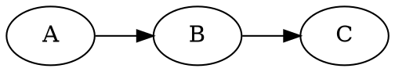

<p align="center">
  
</p>

# refract

Turn a small, readable **markdown** slide deck into
[RemoteCompose](https://developer.android.com/jetpack/androidx/releases/compose-remote)
slides you can play in the C++ desktop viewer or the TypeScript player.

```
slides.md ─► refract.py ─► component JSON (androidx format) ─► json2rc ─► .rc
```

refract emits the **androidx component JSON** format and lets the real `remote-core`
library serialize it — Python never touches the wire format, and layout is done by
the RemoteCompose engine via components, not pixel math.

## Quick start

```sh
python3 refract.py examples/deck               # writes examples/deck/out/*.rc
prebuilt/rcviewer examples/deck/out 1600 900   # play it (N/P to step, R to reload)
```

Requires Python ≥ 3.11 (stdlib `tomllib`). Graphs need `graphviz` (`dot`) on PATH.
`prebuilt/` ships ready-to-run `json2rc`, `rcviewer` and `rc2image`.

## Deck layout on disk

```
<deck>/
  slides.md          # the deck
  settings.toml      # optional per-deck settings (colors, size, transitions, shader…)
  shader.sksl        # optional background shader referenced from settings.toml
  includes/          # images, sub-decks, .rc / .json resources
  out/               # generated .rc files          (created)
  out/json/          # generated .json documents     (only with --json)
```

## Markdown grammar

```markdown
:: title : Nico
# refract
*Markdown to RemoteCompose*
<logo.png>

---

:: content [2:3] : Nico
# Two panes
- a point
  - a sub-point
- another

+++


```

- `---` on its own line separates slides (one `.rc` each).
- `:: <type> [flags] [@author] [: <speaker>] [ratio] [key=value…]` right after the
  separator sets slide metadata:
  - `@author` attributes the slide to an author from `[authors]` — the slide takes
    that author's colour as its accent and shows their name in the chrome. On an
    `include` it attributes every slide it pulls in (a slide's own `@author` wins).
  - `<speaker>` (after `:`) selects an accent colour from `[speakers]`.
  - `[ratio]` sets pane widths (see Panes); `key=value` are per-slide overrides
    (`bg`, `accent`, `shader=none`, `transition=push`…); bare-word `flags` include
    `fragment` (see Fragments).
- The first `# heading` is the title.
- An `*italic*` line right under the title is a **subtitle** (accent colour).
- Inline **`**bold**`**, *`*italic*`* and `` `code` `` work inside any text/bullet; a
  styled line wraps to the available width (word by word) and keeps a shared text
  **baseline** across mixed styles.
- Author names from `[authors]` are tinted with their colour wherever they appear in
  body text (e.g. the title-slide byline).
- A `???` line starts **speaker notes** — the rest of the slide goes to `out/notes.md`.
- Everything else is content **blocks**, in order.

### Slide types (`<type>`)

| Type      | Layout                                                        |
|-----------|---------------------------------------------------------------|
| `title`   | large title centered; an image renders above it (logo size)   |
| `section` | title centered, auto-numbered (the number is tinted with `[theme] primary`); section slides default to a slide-up transition |
| `content` | default — title at top, content below, left-aligned           |
| `split`   | two columns from `+++`, laid out row-first: the **right** column runs full-height (from the top, past the title) while the **title** is confined to the **left** column's width; `[ratio]` sets the split (default 1:1) |
| `max`     | near-fullscreen — small margin so the content is maximised, a smaller title (if any), chrome still shown; great for a full-bleed graph, image, video or web page |
| `include` | splice a sub-deck from `includes/<param>/slides.md` (or a `<section … will go there>` placeholder) |
| `outline` | replaced by a synthesized outline of the deck's `section` slides — numbers in the primary colour beside each section title |
| `agenda`  | like `outline` but a plainer numbered bullet list |

### Content blocks

| Block         | Markdown                                                       |
|---------------|---------------------------------------------------------------|
| text          | plain paragraphs                                              |
| subtitle      | `*italic*` line directly under the title                     |
| bullet list   | `- item`, indent two spaces per sub-level; marker shape/fill/colour and per-sub-level font set by `[bullet]` (see settings) |
| table         | markdown pipe table `\| a \| b \|` (first row = header)      |
| code          | fenced ```` ``` ```` block — **syntax-highlighted** (kotlin, java, json) |
| graph         | fenced ```` ```dot ```` / `neato` / `fdp` / `circo` … — laid out by graphviz, drawn by refract (clusters, dashed/dotted/coloured edges, per-node colours, neon node glow) |
| chart         | fenced ```` ```chart-bar ```` / `chart-line` / `chart-pie` with `label: value` lines |
| image         | `<name.png>` (`.jpg/.gif/.webp`) — embedded **inline** in the `.rc` |
| code file     | `<name.kt>` (`.java/.py/.ts`) — the file rendered as a highlighted code block |
| video         | `<name.mp4>` (`.mov/.m4v`) — **embedded** in the page (a native custom component the viewer plays in place); a lone video with no title fills the slide |
| json include  | `<name.json>` — a RemoteCompose JSON document embedded **live** as components |
| rc include    | `<name.rc>` — a prebuilt RemoteCompose doc embedded **live** in the slide: spliced flat if a sibling `.json` exists, else painted as a nested sub-document (its own id space, animates on its own, and receives mouse drags — e.g. rotate a 3D plot). A lone `.rc` (no title) is a whole-slide passthrough. Scaling via `[embed] fit`. The asset is copied to `out/media/` (not listed as a slide). |
| web link      | `<https://url>` (optional `\| label`) — an interactive web page **embedded in the page** (a native custom component, like video); the viewer places a live, clickable browser over its box |

Includes are resolved from `includes/`; the extension may be omitted (`<logo>`
finds `logo.png`). Speaker accent comes from `[speakers]` (below).

### Panes

Split a slide with `+++`; a ratio in the metadata sets the pane **widths** (height is
shared): `:: content [2:3]`, `:: [1:1]`, `:: [2:2:4]` — one number per pane.

The **`split`** slide type reuses the same `+++` split but lays it out row-first — the right
column runs full-height past the title, and the title is confined to the left column:

```markdown
:: split [3:2]
# Left title
- a point
+++
```kotlin
fun rightColumn() { }
```
```

## Transitions & "magic move"

`--transitions` (or `[transition] enabled = true`) animates each slide in from the
previous one on load. Styles (`[transition] style` or per-slide `transition=`):

- **fade** (default) — a `StateLayout` crossfade.
- **push** / **slide** — the previous slide slides out while the new one slides in
  (horizontal). Use **`slide-up`** (`push-up`) for a vertical move — the previous
  slide travels up and off while the new one rises from the bottom.
- **magic move** (automatic between two consecutive graph slides) — nodes matched by
  their dot identifier glide/resize to their new positions (snappy ease-out), edges
  morph along (resampled so their splines interpolate), and unmatched elements fade.

The first slide has **no in-transition** (nothing to come from) — it renders
statically and its *out* is animated by the next slide. So `:: section transition=slide-up`
on the slide after the title makes the title glide up as that slide rises in.

Push/slide **speed** is the slide time in seconds — set `[transition] duration` globally
or `transition_duration=` per slide (larger = slower), e.g.
`:: section transition=slide-up transition_duration=0.9`.

**Per-slide-type defaults** live in `[transition.<type>]`, so every slide of a type shares a
transition without repeating it. Section slides default to sliding up from below via:

```toml
[transition.section]
style    = "slide-up"
duration = 0.9
fx       = true          # draw the [shader.transition] overlay during the transition
```

Precedence for each knob: per-slide `transition*=` override → `[transition.<type>]` →
`[transition]` → built-in default.

```sh
python3 refract.py examples/deck --transitions
```

### Content reveal (animate content in)

How bullets and content blocks appear when a slide loads, set by `[reveal] mode` and
overridable per slide with `reveal=`:

- **immediate** (default) — everything appears at once.
- **stagger** — items cascade in (fade + a small upward slide, snappy ease-out), each a
  little after the last. Timing via `[reveal] delay` / `stagger` / `duration` / `rise`.

```markdown
:: content reveal=stagger
# Cascades in
- first
- second
- third
```

The reveal runs on load (it also plays as a slide transitions in); the *outgoing* slide of
a transition is never re-revealed.

### Stepped reveal — one `.rc` per step (progressive)

To reveal bullets across **separate slides** (press the next key → the next bullet appears),
enable *steps*. refract expands the slide into one `.rc` per cumulative top-level bullet; each
step after the first animates just the newly-revealed bullet in (via the `:: same` diff).

- Per slide: the `fragment` / `steps` flag turns it on; `nosteps` (or `steps=off`) turns it off.
- Globally: `[reveal] steps = true` makes every bullet slide stepped by default.

```markdown
:: content steps
# Build it up
- first
- second
- third
```

## settings.toml

```toml
[slide]
width     = 1600
height    = 900
title_gap = 44                  # vertical gap between title and content

[theme]
preset          = "dark"        # dark | light | midnight | warm | mono (applied first)
background      = "#FF141A2E"
title_color     = "#FFFFFFFF"
body_color      = "#FFE6EEF6"
accent          = "#FF4FC3F7"   # subtitles, table headers, emphasis (overridable per slide)
primary         = "#FF4FC3F7"   # deck brand colour (section numbers, outline); stable across
                                # slides. Defaults to accent if unset.
table_bg        = "#1AFFFFFF"
table_header_bg = "#22FFFFFF"

[chrome]                        # optional slide chrome (never shown on the title slide)
page     = true                 # "n / total" page number
footer   = "RemoteCompose · 2026"
progress = true                 # bottom progress bar
section_marks  = true           # mark above the bar at each section start
mark_shape     = "circle"       # circle | square | four | quad | diamond | asanoha | hline | vline
mark_filled    = true           # filled shape, or false for an outline
progress_color = "current"      # "current" = current speaker's accent (default);
                                # "section" = each section coloured by its expected speaker
color    = "#66FFFFFF"

[bullet]                        # bullet-point marker
shape  = "circle"               # circle | square | four (diamond crest) | quad (square crest)
                                # | diamond | asanoha (hemp-leaf) | hline | vline
filled = true                   # filled shape, or false for an outline
color  = "#FF4FC3F7"            # the marker's own colour (default: the deck primary accent)
# Sub-levels (indented bullets, level >= 1) may differ from the top level:
sub_shape  = "hline"            # marker shape for sub-bullets ("" = same as shape)
sub_font   = "Avenir Next"      # text font family for sub-bullets ("" = same as body)
sub_weight = 300                # text weight for sub-bullets (thinner here)
sub_color  = "#FFB8C2D0"        # text colour for sub-bullets (light grey)

# Per-author colours. A slide/include marked "@Nico" takes that colour as its accent
# and shows the name in the chrome; names are also tinted wherever they appear in text.
# Full and short forms can both be listed (matched whole-word, longest first).
[authors]
"Nicolas Roard" = "#FF5CC8FF"
"Nico"          = "#FF5CC8FF"
"John Hoford"   = "#FFF6A96B"
"John"          = "#FFF6A96B"

# Per-speaker accent (":: content : Nico" → this colour for that slide).
[speakers]
Nico = "#FF4FC3F7"
John = "#FF81C995"
Yuri = "#FFFFB74D"

# Font sizes (px). Aliases: title (title-slide) / section / heading (content title) /
# body (content) / subtitle / table / code. Direct keys also work (content_body…).
# Named system font families + weights: title_* for headings, body_* for everything
# else, code_family for code. Resolved by the OS font manager (macOS CoreText / Linux
# fontconfig), so any installed family works.
[font]
heading  = 76
body     = 44
subtitle = 48
table    = 40
title_family = "Futura"         # headings
title_weight = 500              # 100–900 (Medium here)
body_family  = "Avenir Next"    # body / bullets / subtitle / tables
body_weight  = 400
code_family  = "SF Mono"        # code blocks & spans

[image]
corner_radius = 28              # round embedded images

[embed]                         # prebuilt `.rc` sub-documents (<name.rc>)
fit = "fit"                     # fit (aspect, centred) | fill (cover) | native (1:1)

[code]
background    = "#FF1E1E1E"
foreground    = "#FFD4D4D4"
font_size     = 28
corner_radius = 18              # round the code panel
[code.syntax]                   # any subset; rest use defaults
keyword = "#FFC586C0"
type    = "#FF4EC9B0"
string  = "#FFCE9178"
number  = "#FFB5CEA8"
comment = "#FF6A9955"
key     = "#FF9CDCFE"           # JSON property names
literal = "#FF569CD6"           # true / false / null

[graph]
node_fill   = "#FF1B2A3D"
node_stroke = "#FF4FC3F7"
node_text   = "#FFE6EEF6"
edge        = "#FF89A7C2"

[shader]                        # animated background (SkSL)
file = "shader.sksl"            # or source = """...SkSL..."""
[shader.title]                  # optional per-slide-type override
file = "title.sksl"

[transition]
enabled = false                 # same as --transitions
style   = "fade"                # fade | push | slide | slide-left | slide-up | push-up
duration = 0.45                 # push/slide time in seconds (larger = slower)
[transition.section]            # per-slide-type defaults (any [transition.<type>])
style    = "slide-up"           # section slides rise up from below…
duration = 0.9
fx       = true                 # …with the [shader.transition] overlay on

[reveal]                        # how content appears on a slide
mode     = "immediate"          # immediate | stagger (cascade bullets/blocks in)
delay    = 0.0                  # seconds before the first item animates
stagger  = 0.12                 # seconds between items
duration = 0.32                 # per-item animation time
rise     = 26                   # px each item slides up as it fades in
steps    = false                # also split bullet slides into one .rc per step
```

Precedence: **CLI flag > settings.toml > built-in default**. Any theme colour /
shader / accent can also be overridden per slide via `key=value` metadata
(e.g. `:: content bg=#FF101820 accent=#FFE8955A shader=none`).

### Background shaders

A slide background can be an animated SkSL shader (`iResolution`, `iTime` uniforms;
`iTime` is `animTime`, so it animates). It's drawn full-slide behind transparent
content. Different types can use different shaders via `[shader.<type>]`
(`title` / `section` / `content`), e.g. give title/section slides their own backdrop:

```toml
[shader.title]
file = "dotgrid.sksl"           # e.g. a dot grid lit by a slowly-drifting glow
[shader.section]
file = "dotgrid.sksl"
```

`examples/deck/dotgrid.sksl` is such a backdrop — a grid of dots with a soft light that
orbits over time, brightening different dots as it moves.

A shader can also sit behind just the **title element** of a content slide (on top of the
slide's own background), giving the heading its own animated band:

```toml
[title]
shader = "title-dots.sksl"
```

The band is larger than the heading, so make the shader **transparent** (premultiplied
`half4`) and fade it toward the edges — it then composites over the slide background and
attenuates around the title instead of looking clipped. `examples/deck/title-dots.sksl`
does this (the transparent, edge-fading sibling of the full-slide `dotgrid.sksl`). This
applies to content/`max` slides; title & section slides use their full-slide
`[shader.<type>]` instead.

A **transition overlay** shader (`[shader.transition]`) is drawn on top of the slide
*only while a transition plays*. In addition to `iResolution`/`iTime` it receives an
`iProgress` uniform (the transition's 0→1 progress), so the effect can envelope itself
to nothing at the start and end. Return a **premultiplied** `half4` (it composites over
the slide). The bundled example (`examples/deck/transition.sksl`) drifts light dots up
from the bottom that fade out quickly. It is **opt-in per slide** — add
`transition_fx=on` to the metadata of the slide whose transition should show it
(e.g. `:: section transition=slide-up transition_fx=on`).

```toml
[shader]
file = "shader.sksl"            # background, all slides
[shader.transition]
file = "transition.sksl"        # overlay, during transitions only (gets iProgress)
```

### Embedded video & custom components

The C++ player supports RemoteCompose **custom components** (`LAYOUT_CUSTOM`, op 93): a
leaf that the core lays out like any component, then delegates drawing to a host
(`CustomComponentHost`) keyed by a `config` string. This keeps the core
platform-agnostic while an app supplies renderers for things Skia alone can't do.

The viewer ships two hosts, both keyed off the `config` string:

- **video** (`config: "video:<file>"`, AVFoundation) — `<name.mp4>` plays in place,
  aspect-fit, looping. The file is copied next to the slides and referenced by name.
  A lone video with no title fills the whole slide instead.
- **web** (`config: "web:<url>"`, WKWebView) — `<https://url>` embeds a live, clickable
  browser positioned over the component's box; it follows layout and transitions and
  supports file-open dialogs.

```markdown
# Live demo
Watch it run:

<demo.mp4>

# The Spec
<https://example.dev/spec | Reference>
```

Custom components need the ANDROIDX+EXPERIMENTAL profile, which refract sets
automatically. (macOS only for now — other platforms draw nothing; and PDF/screenshot
export doesn't run the hosts, so embedded video/web are blank in exports.)

## CLI

```
python3 refract.py <deck> [options]
  --width / --height     slide size (default 1600×900 or settings.toml)
  --transitions          crossfade / push / graph magic move between slides
  --debug                1px red outline on every component
  --watch                regenerate on slides.md / settings / includes changes
  --pdf [PATH]           export the deck to a PDF (default <deck>/out/deck.pdf)
  --images [DIR]         export each slide to a PNG (default <deck>/out/images/)
  --json                 keep the intermediate JSON in out/json/ (default: discard)
  --json-only            emit JSON only; do not run json2rc
  --json2rc PATH         explicit json2rc launcher (default: auto-detect prebuilt)
```

Speaker notes (`???` blocks) are written to `<deck>/out/notes.md`.

## Prebuilt tools

- `prebuilt/json2rc` — JSON → `.rc` converter (built from the local androidx checkout;
  adds an `image` component that embeds a file inline)
- `prebuilt/rcviewer` — interactive C++ viewer (also `--pdf` / `--screenshot`).
  Keys: **←/→** step, **Space** pause, **R** reload, **D** debug, **S** screenshot,
  **Q/Esc** quit. Embedded web pages are live in the slide; click to interact, **Esc**
  returns keyboard focus to the deck. Slides are laid out at their design size and
  scaled to fit the window, so they fill fullscreen.
- `prebuilt/rc2image` — headless `.rc` → PNG (`--anim <sec>` pins the animation time)

## Architecture

Implementation lives in the `refractkit` package; `refract.py` is just the CLI.

| Module        | Responsibility                                            |
|---------------|-----------------------------------------------------------|
| `settings`    | load `settings.toml` (stdlib `tomllib`)                   |
| `theme`       | `Theme` (colors, fonts, code+syntax, chrome, shaders, presets) from settings |
| `markdown`    | slide markdown → `{meta, title, blocks, notes}`          |
| `deck`        | load `slides.md`, expand deck includes, resolve includes  |
| `components`  | low-level component builders (`text`, `dbg`)              |
| `inline`      | inline `**bold**` / `*italic*` / `` `code` `` → styled spans |
| `images`      | image dimensions + contained bitmap canvas (+ rounded clip) |
| `highlight`   | syntax highlighting — a language registry                 |
| `graph`       | graphviz layout → drawing (clusters/styles); magic-move geometry |
| `chart`       | bar / line / pie charts on a canvas                       |
| `render`      | blocks + theme → RemoteCompose component JSON             |

**Add a language:** drop a `tokenize_x` in `highlight.py` and register it in
`LANGUAGES`. **Restyle:** edit `settings.toml`. **Change the background:** edit the
`.sksl`.

## Tests

```sh
python3 -m unittest discover -s tests
```

## Notes

- Images embed **inline** (the C++ viewer only renders inline images, not URL/file refs).
- A binary `.rc` can't be spliced into a JSON tree, so live rc-embed uses the sibling
  `.json`.
- Graph magic move uses expression-interpolation (matched by dot id), which fits
  canvas-drawn graphs and needs no player changes.
- **Custom components** (`LAYOUT_CUSTOM`, op 93) delegate drawing to a host keyed by a
  `config` string; the viewer's video host plays embedded `<name.mp4>` in place — see
  *Embedded video & custom components* above.
- **Graph node glow** is a real gaussian blur: the bright node borders are drawn into a
  layer with a `graphicsLayer` **blur render effect** (the Skia equivalent of Android
  `RenderEffect.createBlurEffect`), behind the crisp graph. Tunable/disable-able via
  `[graph] glow`, `glow_radius`, `glow_strength`. Implementing this added blur support to
  the C++ player (`saveLayerWithBlur`) and exposed a `blur` key on the `graphicsLayer`
  JSON modifier — both reusable beyond graphs.
- **Push transitions share one background**: when the outgoing and incoming slides use the
  same background (shader or solid), it's drawn once behind the stage and only the
  foreground content slides — half the full-slide shader work per frame, so the animate-in
  stays smooth. The ambient background simply doesn't slide (visually equivalent).
