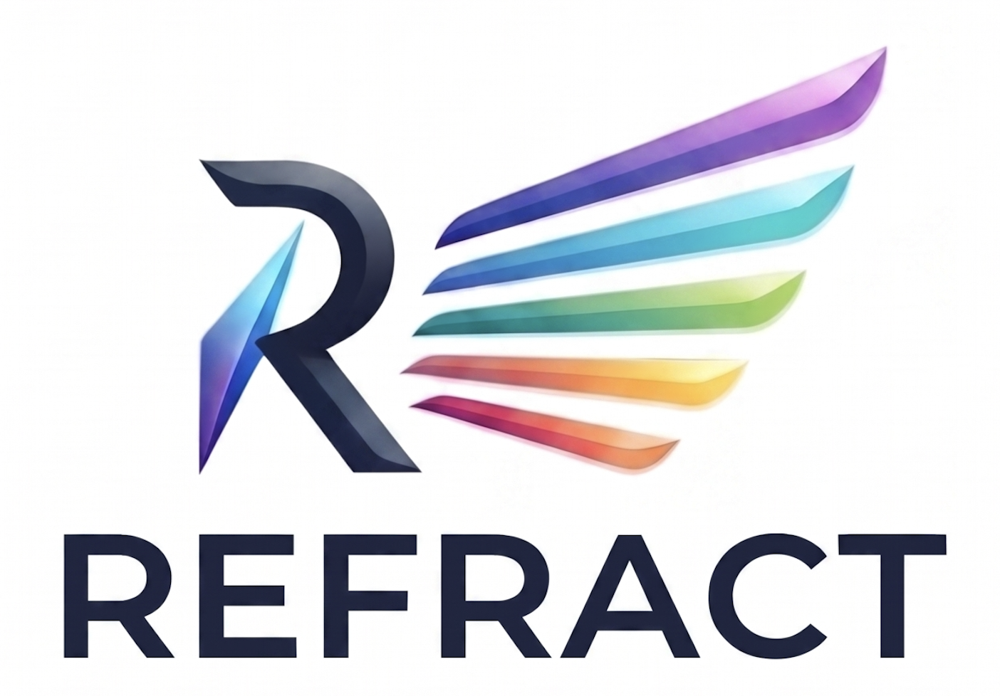
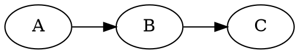

<p align="center">
  
</p>

# refract

Turn a small, readable **markdown** slide deck into
[RemoteCompose](https://developer.android.com/jetpack/androidx/releases/compose-remote)
slides you can play in the C++ desktop viewer or the TypeScript player.

```
slides.md ─► refract.py ─► component JSON (androidx format) ─► json2rc ─► .rc
```

refract emits the **androidx component JSON** format and lets the real `remote-core`
library serialize it — Python never touches the wire format, and layout is done by
the RemoteCompose engine via components, not pixel math.

## Quick start

```sh
python3 refract.py examples/deck               # writes examples/deck/out/*.rc
prebuilt/refractplayer examples/deck/out       # present it (→ steps, Tab jumps, H for keys)
```

Requires Python ≥ 3.11 (stdlib `tomllib`). Graphs need `graphviz` (`dot`) on PATH.
`prebuilt/` ships ready-to-run `json2rc`, `refractplayer`, `rcviewer` and `rc2image`.

**`refractplayer`** is the deck player, and it is where a deck is presented *and* edited:

| | | |
|---|---|---|
| presenter window | `P` | clock, timer, notes, the next slide, pace against a rehearsal |
| navigator | `Tab` | the deck as a list, to jump somewhere |
| deck view | `V` | every slide at once; drag to reorder, fold sections, add and delete |
| slide editor | `E` | the markdown behind the slide on screen |
| build panel | `M` | refract's options, and a Rebuild button |
| captions | `C` | the recorded narration, word by word |

The middle three write back to `slides.md` and re-run refract, so a deck can be rearranged
and rewritten without leaving the player. It also records and replays a rehearsal, transcribes
the narration, and exports to PDF (`--pdf talk.pdf`), PNGs (`--images dir/`) or a
self-contained web page (`--web dir/`). See **[player/README.md](player/README.md)**.

`rcviewer` is the plain RemoteCompose viewer; it shares the same playback and export code,
and adds `--screenshot` / `--frames` for single-file headless capture.

## Deck layout on disk

```
<deck>/
  slides.md          # the deck
  settings.toml      # optional per-deck settings (colors, size, transitions, shader…)
  shader.sksl        # optional background shader referenced from settings.toml
  includes/          # images, sub-decks, .rc / .json resources
  out/               # generated .rc files           (created)
  out/deck.json      # deck outline + provenance      (created)
  out/.refract-cache.json  # what the last build produced (incremental builds)
  out/notes.md       # speaker notes                 (when the deck has any)
  out/timing.json    # rehearsal trace               (refractplayer --record)
  out/json/          # generated .json documents     (only with --json)
  voice/             # one NN.wav per slide          (refractplayer --record-audio)
  voice/index.json   # which wav belongs to which slide, so a reorder does not break it
  voice/NN.txt       # its transcript                (refractplayer --transcribe)
  voice/NN.words.json# per-word caption timings      (refractplayer --transcribe)
```

## Markdown grammar

```markdown
:: title : Nico
# refract
*Markdown to RemoteCompose*
<logo.png>

---

:: content [2:3] : Nico
# Two panes
- a point
  - a sub-point
- another

+++


```

- `---` on its own line separates slides (one `.rc` each).
- `:: <type> [flags] [@author] [: <speaker>] [ratio] [key=value…]` right after the
  separator sets slide metadata:
  - `@author` attributes the slide to an author from `[authors]` — the slide takes
    that author's colour as its accent and shows their name in the chrome. On an
    `include` it attributes every slide it pulls in (a slide's own `@author` wins).
  - `<speaker>` (after `:`) selects an accent colour from `[speakers]`.
  - `[ratio]` sets pane widths (see Panes); `key=value` are per-slide overrides
    (`bg`, `accent`, `shader=none`, `transition=push`…); bare-word `flags` include
    `fragment` (see Fragments).
- The first `# heading` is the title.
- An `*italic*` line right under the title is a **subtitle** (accent colour).
- Inline **`**bold**`**, *`*italic*`* and `` `code` `` work inside any text/bullet; a
  styled line wraps to the available width (word by word) and keeps a shared text
  **baseline** across mixed styles.
- Author names from `[authors]` are tinted with their colour wherever they appear in
  body text (e.g. the title-slide byline).
- A `???` line starts **speaker notes** — everything after it, to the slide's end, is
  presenter notes (`??? text` puts the first line on the marker itself). They're written to
  `out/notes.md` and to a per-slide `out/<slide>.rc.notes` sidecar, which the player shows in
  the presenter window and the PDF export lays out in a panel **below** the slide (the page
  grows taller so notes never overlap the slide).
- A `===` line **stacks** the slide — see [Stacked sections](#stacked-sections).
- Everything else is content **blocks**, in order.

### Slide types (`<type>`)

| Type      | Layout                                                        |
|-----------|---------------------------------------------------------------|
| `title`   | large title centered; an image renders above it (logo size)   |
| `section` | title centered, auto-numbered (the number is tinted with `[theme] primary`); section slides default to a slide-up transition |
| `content` | default — title at top, content below, left-aligned           |
| `split`   | two columns from `+++`, laid out row-first: the **right** column runs full-height (from the top, past the title) while the **title** is confined to the **left** column's width; `[ratio]` sets the split (default 1:1) |
| `max`     | near-fullscreen — small margin so the content is maximised, a smaller title (if any), chrome still shown; great for a full-bleed graph, image, video or web page |
| `include` | splice a sub-deck from `includes/<param>/slides.md` (or a `<section … will go there>` placeholder) |
| `outline` | replaced by a synthesized outline of the deck's `section` slides — numbers in the primary colour beside each section title |
| `agenda`  | like `outline` but a plainer numbered bullet list |

Mark a slide `skip` (`:: content skip`, or `skip=true`) to drop it from the deck entirely —
it's removed before numbering, so it consumes no section number, agenda entry, or page.
Use `skip=false` to keep one while leaving the flag in place.

### Content blocks

| Block         | Markdown                                                       |
|---------------|---------------------------------------------------------------|
| text          | plain paragraphs                                              |
| subtitle      | `*italic*` line directly under the title                     |
| bullet list   | `- item`, indent two spaces per sub-level; marker shape/fill/colour and per-sub-level font set by `[bullet]` (see settings) |
| table         | markdown pipe table `\| a \| b \|` (first row = header)      |
| code          | fenced ```` ``` ```` block — **syntax-highlighted** (kotlin, java, json) |
| graph         | fenced ```` ```dot ```` / `neato` / `fdp` / `circo` … — laid out by graphviz, drawn by refract (clusters, dashed/dotted/coloured edges, per-node colours, neon node glow) |
| chart         | fenced ```` ```chart-bar ```` / `chart-line` / `chart-pie` with `label: value` lines |
| image         | `<name.png>` (`.jpg/.gif/.webp`) — embedded **inline** in the `.rc` |
| code file     | `<name.kt>` (`.java/.py/.ts`) — the file rendered as a highlighted code block |
| video         | `<name.mp4>` (`.mov/.m4v`) — **embedded** in the page (a native custom component the viewer plays in place); a lone video with no title fills the slide. `crop` trims the frame (e.g. black bars). |
| json include  | `<name.json>` — a RemoteCompose JSON document embedded **live** as components |
| rc include    | `<name.rc>` — a prebuilt RemoteCompose doc embedded **live** in the slide: spliced flat if a sibling `.json` exists, else painted as a nested sub-document (its own id space, animates on its own, and receives mouse drags — e.g. rotate a 3D plot). A lone `.rc` (no title) is a whole-slide passthrough. Scaling via `[embed] fit`. The asset is copied to `out/media/` (not listed as a slide). |
| web link      | `<https://url>` (optional `\| label`) — an interactive web page **embedded in the page** (a native custom component, like video); the viewer places a live, clickable browser over its box |

Includes are resolved from `includes/`; the extension may be omitted (`<logo>`
finds `logo.png`). Speaker accent comes from `[speakers]` (below).

**Per-include options** go after a `|`: `<name | key=value …>` (space-separated). For video
and rc/json embeds:
- `crop=l,t,r,b` — a source rectangle as fractions 0–1 (default full); shows only that region,
  scaled to fill the box. Handy to remove black bars around a portrait recording, e.g.
  `<phone.mp4 | crop=0.28,0,0.72,1>`, or to zoom into part of an embedded doc.
- `fit=fit|fill|native` — override the `[embed] fit` for this embed.
- `title=…` — a centred caption drawn below the embed (the embed shrinks to make room). Quote
  it for multiple words: `<widget.rc | fit=fit title="Launcher Widget">`. Works on video,
  rc/json embeds and images.
- `stagger` — reveal this embed on its own step. A slide with N `stagger` embeds expands into
  N+1 generated slides: the first shows none of them, each later slide reveals one more (the
  newest fades in) while already-revealed embeds stay put and not-yet-revealed ones sit
  invisible so the layout never shifts. Great for building up a grid of demos one at a time.

A `crop`/`fit` on a **`.json` or `.rc` include** *frames* it: instead of splicing it flat
into the slide (which re-lays-it-out to fill), refract embeds it as a nested document at its
own design size — so the crop rectangle and scale are well-defined (a `.json` is compiled to
`out/media/<name>.rc` for this). Without `crop`/`fit`, includes splice flat as before.

### Panes

Split a slide with `+++`; a ratio in the metadata sets the pane **widths** (height is
shared): `:: content [2:3]`, `:: [1:1]`, `:: [2:2:4]` — one number per pane.

The **`split`** slide type reuses the same `+++` split but lays it out row-first — the right
column runs full-height past the title, and the title is confined to the left column:

```markdown
:: split [3:2]
# Left title
- a point
+++
```kotlin
fun rightColumn() { }
```
```

### Stacked sections

`+++` splits a slide across; **`===`** (three or more `=`) splits it **down**. Each stacked
section is parsed like a mini-slide — its own `::` type line, its own `# title`, its own
content — and they render one above the next:

```markdown
:: content
# Before and after

- the old way, and what it cost us

===

<before.png>
+++
<after.png>
```

Heights are not shared evenly. A **text** section takes its natural height; the **media**
sections (panes, images, embeds, graphs, charts, videos) divide whatever is left. So a couple
of bullets above two full-height image columns give the images the rest of the slide, not half
of it.

## Transitions & "magic move"

`--transitions` (or `[transition] enabled = true`) animates each slide in from the
previous one on load. Styles (`[transition] style` or per-slide `transition=`):

- **fade** (default) — a `StateLayout` crossfade.
- **push** / **slide** — the previous slide slides out while the new one slides in
  (horizontal). Use **`slide-up`** (`push-up`) for a vertical move — the previous
  slide travels up and off while the new one rises from the bottom.
- **magic move** (automatic between two consecutive graph slides) — nodes matched by
  their dot identifier glide/resize to their new positions (snappy ease-out), edges
  morph along (resampled so their splines interpolate), and unmatched elements fade.

**`:: same`** continues the previous slide: it inherits that slide's **type/layout** and
renders it again with only the *changed* content animated (new blocks fade/slide in, removed
ones collapse out, matched content stays put) — so a `:: same` after a `:: split` lays out as
the same split, letting you add an element to one panel while everything else holds still.

The first slide has **no in-transition** (nothing to come from) — it renders
statically and its *out* is animated by the next slide. So `:: section transition=slide-up`
on the slide after the title makes the title glide up as that slide rises in.

Push/slide **speed** is the slide time in seconds — set `[transition] duration` globally
or `transition_duration=` per slide (larger = slower), e.g.
`:: section transition=slide-up transition_duration=0.9`.

**Per-slide-type defaults** live in `[transition.<type>]`, so every slide of a type shares a
transition without repeating it. Section slides default to sliding up from below via:

```toml
[transition.section]
style    = "slide-up"
duration = 0.9
fx       = true          # draw the [shader.transition] overlay during the transition
```

Precedence for each knob: per-slide `transition*=` override → `[transition.<type>]` →
`[transition]` → built-in default.

```sh
python3 refract.py examples/deck --transitions
```

### Content reveal (animate content in)

How bullets and content blocks appear when a slide loads, set by `[reveal] mode` and
overridable per slide with `reveal=`:

- **immediate** (default) — everything appears at once.
- **stagger** — items cascade in (fade + a small upward slide, snappy ease-out), each a
  little after the last. Timing via `[reveal] delay` / `stagger` / `duration` / `rise`.

```markdown
:: content reveal=stagger
# Cascades in
- first
- second
- third
```

The reveal runs on load (it also plays as a slide transitions in); the *outgoing* slide of
a transition is never re-revealed.

### Stepped reveal — one `.rc` per step (progressive)

To reveal bullets across **separate slides** (press the next key → the next bullet appears),
enable *steps*. refract expands the slide into one `.rc` per cumulative top-level bullet; each
step after the first animates just the newly-revealed bullet in (via the `:: same` diff).

- Per slide: the `fragment` / `steps` flag turns it on; `nosteps` (or `steps=off`) turns it off.
- Globally: `[reveal] steps = true` makes every bullet slide stepped by default.

```markdown
:: content steps
# Build it up
- first
- second
- third
```

### Overflowing content — autosize & scroll

When a slide's text is taller than the content area, there are three ways to handle it:

**1. Autosize (default).** The body font shrinks just enough that the content fits — never
enlarges, so slides that already fit are untouched. It applies per content column (including
each side of a `:: split` and each pane), and it won't shrink past a floor (default 0.5×;
content that still overflows wants scrolling instead). Tune or disable it:

```toml
[layout]
autosize     = true    # deck-wide on/off
autosize_min = 0.5     # smallest allowed fraction of the base body size
```

```markdown
:: content autosize=false    # opt a single slide out
```

**2. Scroll pages (`scroll = N` / `scroll = auto`).** Instead of shrinking, keep the text
full-size and split it across generated slides that scroll the content window. Pressing next
scrolls down (animated). `auto` makes as many pages as needed; an explicit count spreads the
content evenly across exactly that many pages. On a `:: split` slide it scrolls the **first**
column (the text) while the other column stays fixed.

```markdown
:: content scroll=auto
# Long API reference
… lots of text …
```

**3. Scroll-aware `:: same`.** Tag several `:: same` slides with a manual `scroll=` offset (in
viewport fractions — `1` = one screenful down) to step through overflowing content yourself,
so the content scrolls between slides while the shared-element diff animates.

```markdown
:: same scroll=0
# Spec walk-through
… long content …
---
:: same scroll=1        # same content, scrolled one screen down
# Spec walk-through
… long content …
```

## settings.toml

```toml
[slide]
width     = 1600
height    = 900
title_gap = 44                  # vertical gap between title and content

[theme]
preset          = "dark"        # dark | light | midnight | warm | mono (applied first)
background      = "#FF141A2E"
title_color     = "#FFFFFFFF"
body_color      = "#FFE6EEF6"
accent          = "#FF4FC3F7"   # subtitles, table headers, emphasis (overridable per slide)
primary         = "#FF4FC3F7"   # deck brand colour (section numbers, outline); stable across
                                # slides. Defaults to accent if unset.
table_bg        = "#1AFFFFFF"
table_header_bg = "#22FFFFFF"

[chrome]                        # optional slide chrome (never shown on the title slide)
page     = true                 # "n / total" page number
footer   = "RemoteCompose · 2026"
progress = true                 # bottom progress bar: a connect-the-dots rail — a thin line
                                # (filled up to the current slide, faint beyond) with marks
                                # sitting ON it, the line leaving a gap around each mark
section_marks  = true           # draw the marks
mark_at        = "speaker"      # "speaker" = a mark at each speaker change (default);
                                # "section" = a mark at each `:: section` start
mark_shape     = "circle"       # circle | square | four | quad | diamond | asanoha | hline | vline
mark_filled    = true           # filled shape, or false for an outline
progress_color = "current"      # "current" = whole line in the current slide's accent;
                                # "section" = coloured by who's speaking (changes at include
                                # boundaries, so each speaker's stretch reads in their colour)
color    = "#66FFFFFF"

[bullet]                        # bullet-point marker
shape  = "circle"               # circle | square | four (diamond crest) | quad (square crest)
                                # | diamond | asanoha (hemp-leaf) | hline | vline
filled = true                   # filled shape, or false for an outline
color  = "#FF4FC3F7"            # the marker's own colour (default: the deck primary accent)
# Sub-levels (indented bullets, level >= 1) may differ from the top level:
sub_shape  = "hline"            # marker shape for sub-bullets ("" = same as shape)
sub_font   = "Avenir Next"      # text font family for sub-bullets ("" = same as body)
sub_weight = 300                # text weight for sub-bullets (thinner here)
sub_color  = "#FFB8C2D0"        # text colour for sub-bullets (light grey)

# Per-author colours. A slide/include marked "@Nico" takes that colour as its accent
# and shows the name in the chrome; names are also tinted wherever they appear in text.
# Full and short forms can both be listed (matched whole-word, longest first).
[authors]
"Nicolas Roard" = "#FF5CC8FF"
"Nico"          = "#FF5CC8FF"
"John Hoford"   = "#FFF6A96B"
"John"          = "#FFF6A96B"

# Per-speaker accent (":: content : Nico" → this colour for that slide).
[speakers]
Nico = "#FF4FC3F7"
John = "#FF81C995"
Yuri = "#FFFFB74D"

# Font sizes (px). Aliases: title (title-slide) / section / heading (content title) /
# body (content) / subtitle / table / code. Direct keys also work (content_body…).
# Named system font families + weights: title_* for headings, body_* for everything
# else, code_family for code. Resolved by the OS font manager (macOS CoreText / Linux
# fontconfig), so any installed family works.
[font]
heading  = 76
body     = 44
subtitle = 48
table    = 40
title_family = "Futura"         # headings
title_weight = 500              # 100–900 (Medium here)
body_family  = "Avenir Next"    # body / bullets / subtitle / tables
body_weight  = 400
code_family  = "SF Mono"        # code blocks & spans

[image]
corner_radius = 28              # round embedded images

[embed]                         # prebuilt `.rc` sub-documents (<name.rc>)
fit = "fit"                     # fit (aspect, centred) | fill (cover) | native (1:1)

[code]
background    = "#FF1E1E1E"
foreground    = "#FFD4D4D4"
font_size     = 28
corner_radius = 18              # round the code panel
[code.syntax]                   # any subset; rest use defaults
keyword = "#FFC586C0"
type    = "#FF4EC9B0"
string  = "#FFCE9178"
number  = "#FFB5CEA8"
comment = "#FF6A9955"
key     = "#FF9CDCFE"           # JSON property names
literal = "#FF569CD6"           # true / false / null

[graph]
node_fill   = "#FF1B2A3D"
node_stroke = "#FF4FC3F7"
node_text   = "#FFE6EEF6"
edge        = "#FF89A7C2"

[shader]                        # animated background (SkSL)
file = "shader.sksl"            # or source = """...SkSL..."""
[shader.title]                  # optional per-slide-type override
file = "title.sksl"

[transition]
enabled = false                 # same as --transitions
style   = "fade"                # fade | push | slide | slide-left | slide-up | push-up
duration = 0.45                 # push/slide time in seconds (larger = slower)
[transition.section]            # per-slide-type defaults (any [transition.<type>])
style    = "slide-up"           # section slides rise up from below…
duration = 0.9
fx       = true                 # …with the [shader.transition] overlay on

[reveal]                        # how content appears on a slide
mode     = "immediate"          # immediate | stagger (cascade bullets/blocks in)
delay    = 0.0                  # seconds before the first item animates
stagger  = 0.12                 # seconds between items
duration = 0.32                 # per-item animation time
rise     = 26                   # px each item slides up as it fades in
steps    = false                # also split bullet slides into one .rc per step
```

Precedence: **CLI flag > settings.toml > built-in default**. Any theme colour /
shader / accent can also be overridden per slide via `key=value` metadata
(e.g. `:: content bg=#FF101820 accent=#FFE8955A shader=none`). Nudge one slide's margins
with `pad_left=` / `pad_top=` / `pad_right=` / `pad_bottom=` (px, added to the slide type's
base margin), or `pad=` for all four — e.g. `:: outline pad_left=160` to indent an outline.

### Background shaders

A slide background can be an animated SkSL shader (`iResolution`, `iTime` uniforms;
`iTime` is `animTime`, so it animates). It's drawn full-slide behind transparent
content. Different types can use different shaders via `[shader.<type>]`
(`title` / `section` / `content`), e.g. give title/section slides their own backdrop:

```toml
[shader.title]
file = "dotgrid.sksl"           # e.g. a dot grid lit by a slowly-drifting glow
[shader.section]
file = "dotgrid.sksl"
```

`examples/deck/dotgrid.sksl` is such a backdrop — a grid of dots with a soft light that
orbits over time, brightening different dots as it moves.

A shader can also sit behind just the **title element** of a content slide (on top of the
slide's own background), giving the heading its own animated band:

```toml
[title]
shader = "title-dots.sksl"
```

The band is larger than the heading, so make the shader **transparent** (premultiplied
`half4`) and fade it toward the edges — it then composites over the slide background and
attenuates around the title instead of looking clipped. `examples/deck/title-dots.sksl`
does this (the transparent, edge-fading sibling of the full-slide `dotgrid.sksl`). This
applies to content/`max` slides; title & section slides use their full-slide
`[shader.<type>]` instead.

A **transition overlay** shader (`[shader.transition]`) is drawn on top of the slide
*only while a transition plays*. In addition to `iResolution`/`iTime` it receives an
`iProgress` uniform (the transition's 0→1 progress), so the effect can envelope itself
to nothing at the start and end. Return a **premultiplied** `half4` (it composites over
the slide). The bundled example (`examples/deck/transition.sksl`) drifts light dots up
from the bottom that fade out quickly. It is **opt-in per slide** — add
`transition_fx=on` to the metadata of the slide whose transition should show it
(e.g. `:: section transition=slide-up transition_fx=on`).

```toml
[shader]
file = "shader.sksl"            # background, all slides
[shader.transition]
file = "transition.sksl"        # overlay, during transitions only (gets iProgress)
```

### Embedded video & custom components

The C++ player supports RemoteCompose **custom components** (`LAYOUT_CUSTOM`, op 93): a
leaf that the core lays out like any component, then delegates drawing to a host
(`CustomComponentHost`) keyed by a `config` string. This keeps the core
platform-agnostic while an app supplies renderers for things Skia alone can't do.

The viewer ships two hosts, both keyed off the `config` string:

- **video** (`config: "video:<file>"`, AVFoundation) — `<name.mp4>` plays in place,
  aspect-fit, looping. The file is copied next to the slides and referenced by name.
  A lone video with no title fills the whole slide instead.
- **web** (`config: "web:<url>"`, WKWebView) — `<https://url>` embeds a live, clickable
  browser positioned over the component's box; it follows layout and transitions and
  supports file-open dialogs.

```markdown
# Live demo
Watch it run:

<demo.mp4>

# The Spec
<https://example.dev/spec | Reference>
```

Custom components need the ANDROIDX+EXPERIMENTAL profile, which refract sets
automatically. (macOS only for now — other platforms draw nothing; and PDF/screenshot
export doesn't run the hosts, so embedded video/web are blank in exports.)

## CLI

```
python3 refract.py <deck> [options]
  --width / --height     slide size (default 1600×900 or settings.toml)
  --transitions          crossfade / push / graph magic move between slides
  --debug                1px red outline on every component
  --watch                regenerate on slides.md / settings / includes changes
  --pdf [PATH]           export the deck to a PDF (default <deck>/out/deck.pdf)
  --images [DIR]         export each slide to a PNG (default <deck>/out/images/)
  --json                 keep the intermediate JSON in out/json/ (default: discard)
  --force                rebuild every slide, ignoring the incremental build cache
  --json-only            emit JSON only; do not run json2rc
  --json2rc PATH         explicit json2rc launcher (default: auto-detect prebuilt)
```

### Incremental builds

Builds are incremental: a slide whose output is already up to date is left alone, and only
what changed goes through `json2rc`. Rebuilding an untouched deck does no compilation at all.

What is fingerprinted is the **generated JSON document**, not the markdown. That document is
the entire input to `json2rc`, so an unchanged one means an unchanged `.rc` — and nothing has
to reason about which markdown edit reaches which slide. Several things fall out of that:

- Editing one slide rebuilds that slide. With `--transitions` it also rebuilds the *next*
  one, whose document embeds it.
- Editing an image rebuilds the slides that embed it — by content, so a `touch` or a fresh
  checkout does not.
- **Reordering rebuilds everything from the move onwards.** The page number and progress bar
  are drawn into each document, so a slide that only changed position is not the same slide.
  That is the case a cache keyed on the source text would get wrong.
- A different `json2rc` throws the whole cache away.

The record lives in `<deck>/out/.refract-cache.json`, and it is only ever an optimisation:
delete it, or pass `--force`, and the build is exactly what it always was. Files a build no
longer claims — a renamed or deleted slide's `.rc` — are swept at the end, so nothing stale
is left for the player to pick up.

Speaker notes (everything after a `???` line) are written to `<deck>/out/notes.md` and to a
per-slide `<deck>/out/<slide>.rc.notes` sidecar. `refractplayer` shows them in the presenter
window; the PDF export puts them in a panel below each slide (the page grows to fit them).

### Editing a deck from the player

`out/deck.json` records where every slide was written — which markdown file, and which
`---`-separated block of it. That is what lets `refractplayer` rearrange and rewrite a deck
without a terminal: drag a slide in the deck view, type in the slide editor, press Rebuild in
the build panel, and `slides.md` is what changes. The player never parses markdown itself; the
edits are made by `player/tools/*.py`, which sit on `refractkit.chunks` so the block numbering
is the same one `markdown.py` produces.

```sh
python3 player/tools/reorder.py <deck>/out --move 12 --to 3      # move a slide
python3 player/tools/slide.py   <deck>/out --slide 12 --read     # one slide's markdown
python3 player/tools/build.py   <deck>/out --transitions         # rebuild, and say what it did
```

See [player/README.md](player/README.md#the-editing-loop).

### Captions from a recorded talk

`refractplayer --record-audio` records one wav per slide, `--transcribe` turns those into
per-word caption timings, and `--captions` shows them as a close-caption window with each
word lit as it is spoken (or press `C`). All three are the player's — none of it has anything
to say about turning markdown into slides.

```sh
prebuilt/refractplayer mytalk/out --record-audio     # record
prebuilt/refractplayer mytalk/out --transcribe       # transcribe + align
prebuilt/refractplayer mytalk/out --captions         # play back with captions
prebuilt/refractplayer mytalk/out --web mytalk/web   # …or as a web page
```

`--web` writes a self-contained site that plays the deck in a browser — the real `.rc`
slides rendered by the RemoteCompose TypeScript player, the recorded narration, and captions
lit word by word. It opens by double-clicking `index.html` as well as from a server, and
compresses the narration on the way out. It needs that player's bundle built once
(`cd ../remotecompose-experiments/players/typescript && npm install && npm run bundle`).

Two steps, each with its own optional dependency — the same split
[Echo](https://github.com/camaelon/Echo)'s scripts make, because forced alignment against a
known transcript is far more accurate than a transcriber's own word timings:

```sh
pip install openai-whisper     # transcription (or: pip install faster-whisper)
pip install whisperx           # forced alignment
```

The work itself is Python's — whisper and whisperx live there — so `--transcribe` runs
[`player/tools/captions.py`](player/tools/captions.py), which also stands alone. The
transcript lands in `voice/NN.txt`, so a misheard word can be corrected there and
`--transcribe` re-run: only the alignment is redone, against the text you supplied.

## Prebuilt tools

- `prebuilt/json2rc` — JSON → `.rc` converter (built from the local androidx checkout;
  adds an `image` component that embeds a file inline)
- `prebuilt/refractplayer` — the deck player: presenter window (clock, notes, next slide),
  navigator, talk timer, blanking, fullscreen, rehearsal recording (`--record` /
  `--record-audio`, replayed with `--auto-voice`), a deck view that reorders the deck by
  rewriting its markdown (`V`, or `--deck-view`), a build panel that re-runs refract with its
  options on screen (`M`, or `--build`), a slide editor that rewrites one slide's markdown
  and rebuilds (`E`, or `--editor`), and export to PDF (`--pdf talk.pdf`) or
  PNGs (`--images dir/`). This is what `refract.py --pdf` / `--images` run. Built from `player/`
  on top of the `rcplayer` library in the RemoteCompose `players/cpp` tree — playback,
  export and the custom-component hosts are shared with `rcviewer`, not forked.
  `player/build.sh` rebuilds it. See [player/README.md](player/README.md).
- `prebuilt/rcviewer` — interactive C++ viewer, and the fallback exporter when the player
  has not been built (`--pdf` / `--screenshot-dir` are the same code refractplayer runs;
  `--screenshot` / `--frames` are its own).
  Keys: **←/→** step, **Space** pause, **R** reload, **D** debug, **S** screenshot,
  **Q/Esc** quit. Embedded web pages are live in the slide; click to interact, **Esc**
  returns keyboard focus to the deck. Slides are laid out at their design size and
  scaled to fit the window, so they fill fullscreen.
- `prebuilt/rc2image` — headless `.rc` → PNG (`--anim <sec>` pins the animation time)

## Architecture

Implementation lives in the `refractkit` package; `refract.py` is just the CLI.

| Module        | Responsibility                                            |
|---------------|-----------------------------------------------------------|
| `settings`    | load `settings.toml` (stdlib `tomllib`)                   |
| `theme`       | `Theme` (colors, fonts, code+syntax, chrome, shaders, presets) from settings |
| `markdown`    | slide markdown → `{meta, title, blocks, notes}`          |
| `deck`        | load `slides.md`, expand deck includes, resolve includes  |
| `components`  | low-level component builders (`text`, `dbg`)              |
| `inline`      | inline `**bold**` / `*italic*` / `` `code` `` → styled spans |
| `images`      | image dimensions + contained bitmap canvas (+ rounded clip) |
| `highlight`   | syntax highlighting — a language registry                 |
| `graph`       | graphviz layout → drawing (clusters/styles); magic-move geometry |
| `chart`       | bar / line / pie charts on a canvas                       |
| `render`      | blocks + theme → RemoteCompose component JSON             |
| `chunks`      | the `---`-separated blocks of a slides.md: split, read, replace, insert, delete |
| `reorder`     | moving those blocks — a slide, a section, an included sub-deck |
| `buildcache`  | what the last build produced, so an unchanged slide is not recompiled |
| `manifest`    | reading `out/deck.json`, and replaying the options a deck was built with |

**Add a language:** drop a `tokenize_x` in `highlight.py` and register it in
`LANGUAGES`. **Restyle:** edit `settings.toml`. **Change the background:** edit the
`.sksl`.

The last four are the ones the player edits a deck through. The player never parses markdown
itself: block numbering has to agree exactly with `markdown.py`'s (which splits on `---` with
no awareness of code fences, deliberately reproduced), and a second implementation would drift
and rewrite the wrong slide. `player/tools/*.py` are thin CLIs over them.

## Tests

```sh
python3 -m unittest discover -s tests          # refract, and the player's tools
ctest --test-dir player/build                  # the player's own logic — no window, no GPU
```

The Python suite covers the markdown grammar, rendering, the incremental build, and the tools
the player edits decks through. The C++ suites cover the parts of the player that are pure
logic: the reordering arithmetic, the editor's text model, and the rehearsal trace. Neither
needs a display.

## Notes

- Images embed **inline** (the C++ viewer only renders inline images, not URL/file refs).
- A binary `.rc` can't be spliced into a JSON tree, so live rc-embed uses the sibling
  `.json`.
- Graph magic move uses expression-interpolation (matched by dot id), which fits
  canvas-drawn graphs and needs no player changes.
- **Custom components** (`LAYOUT_CUSTOM`, op 93) delegate drawing to a host keyed by a
  `config` string; the viewer's video host plays embedded `<name.mp4>` in place — see
  *Embedded video & custom components* above.
- **Graph node glow** is a real gaussian blur: the bright node borders are drawn into a
  layer with a `graphicsLayer` **blur render effect** (the Skia equivalent of Android
  `RenderEffect.createBlurEffect`), behind the crisp graph. Tunable/disable-able via
  `[graph] glow`, `glow_radius`, `glow_strength`. Implementing this added blur support to
  the C++ player (`saveLayerWithBlur`) and exposed a `blur` key on the `graphicsLayer`
  JSON modifier — both reusable beyond graphs.
- **Push transitions share one background**: when the outgoing and incoming slides use the
  same background (shader or solid), it's drawn once behind the stage and only the
  foreground content slides — half the full-slide shader work per frame, so the animate-in
  stays smooth. The ambient background simply doesn't slide (visually equivalent).
