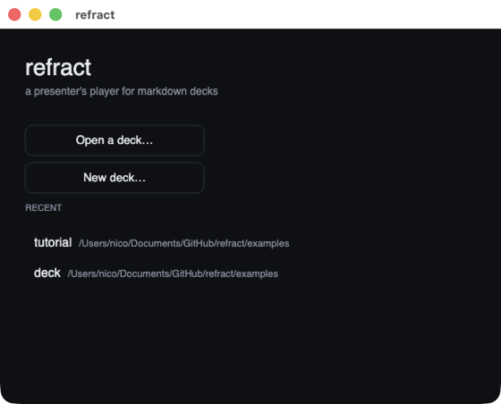
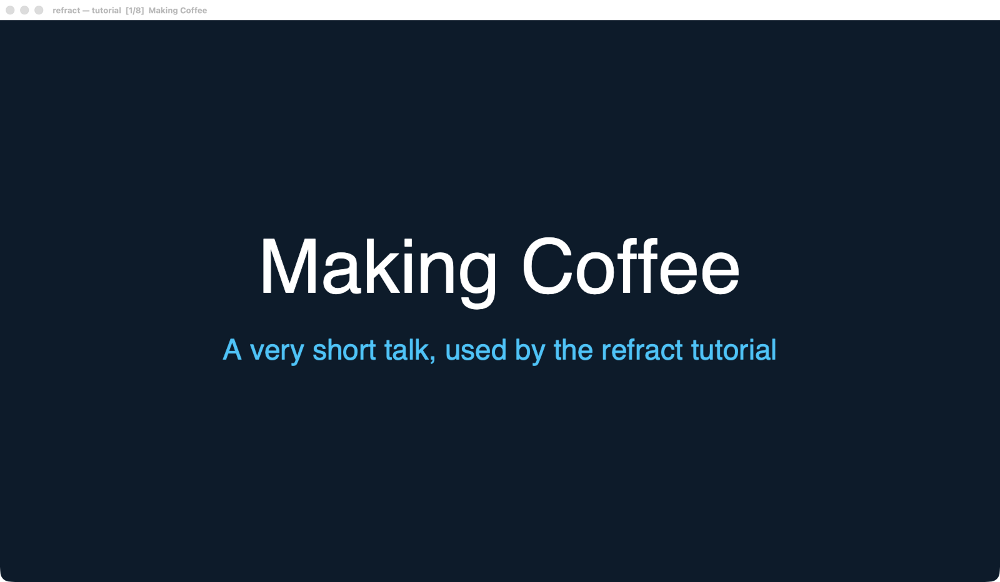
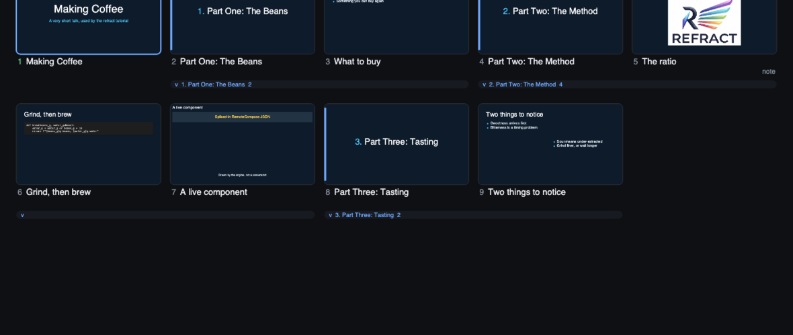
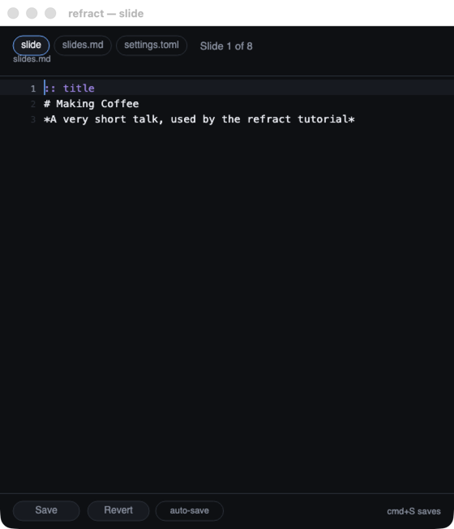
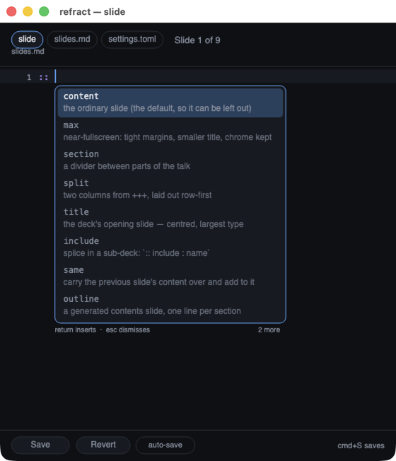
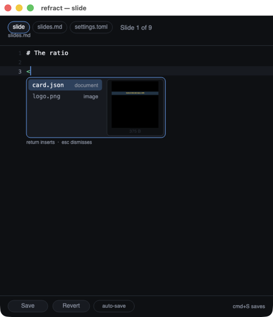
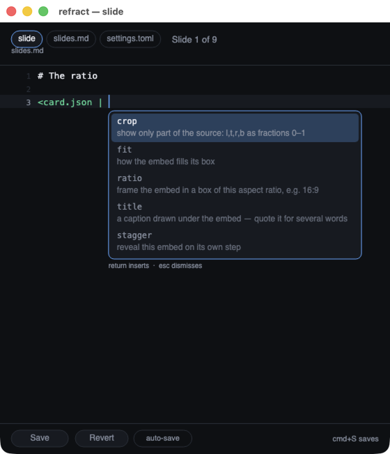
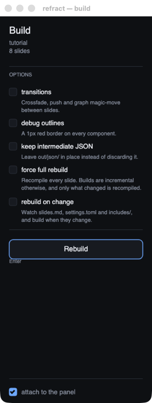
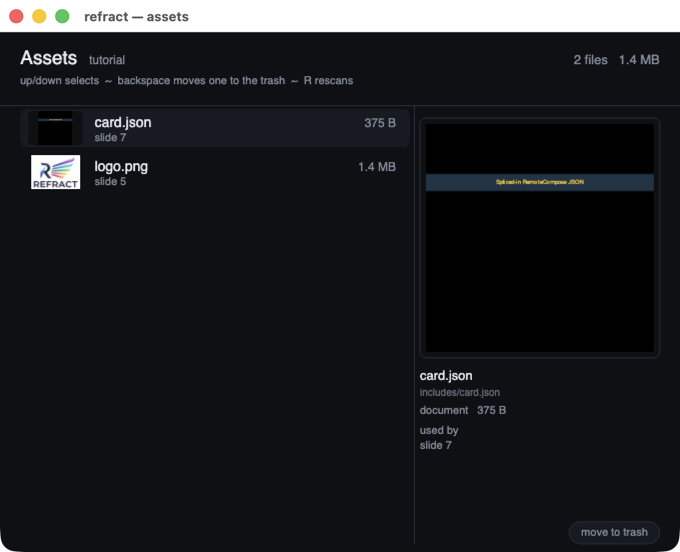
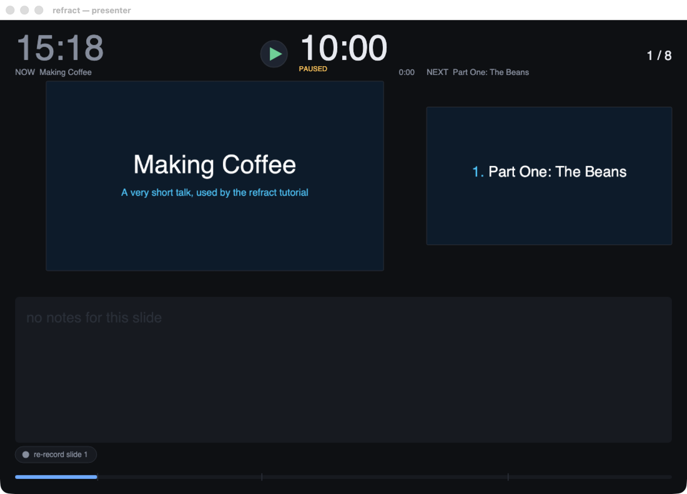

# refractplayer

A deck is markdown, but you do not have to write it in a text editor and you do not have to
leave the player to change it. This is the tool a talk gets *made* in, and then given from.

Two halves to this page: a **[tutorial](#tutorial-write-a-talk-without-a-terminal)** that
builds a small talk in the player's own windows, and a **[reference](#the-windows)** for each
window. The deck used throughout is [`examples/tutorial/`](../examples/tutorial), so anything
here can be opened and poked at.

For the same deck built from a terminal instead, see
**[the command-line tutorial](tutorial-cli.md)**.

---

## Tutorial: write a talk without a terminal

### Start with nothing

```sh
prebuilt/refractplayer
```



**New deck…** asks where to put it and writes a starter `slides.md` — a real deck of a few
slides, not an empty file, so there is something to change rather than something to invent.
**Open a deck…** takes any folder with a `slides.md` in it. Decks you have opened before are
listed underneath; the player remembers them across runs.

Name a deck on the command line and it skips straight past this:

```sh
prebuilt/refractplayer examples/tutorial
```

### The deck itself



This window is what the room sees. Arrows move, `Space` advances, `H` brings up the key card,
`F` goes fullscreen, `B` blanks the screen. Everything else in the player is a second window
that leaves this one alone.

Point it at a deck folder and `out/` is found underneath — and **built if it is not there**,
so a deck you have only written is one command from being presented.

### See the whole talk: `V`



Every slide at once. The bars under the rows are **sections** and the sub-decks an
`:: include` pulled in: click one to fold it away, drag one to move the whole run. Drag a
single card to reorder it, and the markdown behind it is rewritten and the deck rebuilt —
this is not a preview of a reorder, it *is* the reorder.

`N` adds a slide, `⌫` twice deletes one, `shift`+`D` duplicates, `J` joins two, and `cmd`+`Z`
takes any of it back. A slide with narration recorded against it shows it here, and a slide
with speaker notes is marked `note`.

### Change a slide: `E`



The markdown behind whatever is on screen. It follows the deck as you move, so navigating is
how you choose what to edit. `cmd`+`S` saves, and the deck rebuilds and reloads underneath.

The tabs at the top point it at one **slide**, the whole **slides.md**, or the deck's
**settings.toml** — the theme was the last thing that needed a terminal, and now it does not.

### It knows the vocabulary

Type `::` and pause, and it offers what may follow, with a line saying what each one is for:



That list is not the player's idea of refract's grammar — it is refract's own, read out of the
build. A slide type that exists is offered; one that does not, is not.

Type `<` and pause, and it offers **the deck's own files**, with a preview of the one under
the cursor. A document or a clip is *rendered*, by the same engine that plays the deck:



Past a `|`, it offers what that embed can be told — and only what would do something to *that*
kind of file:



### Rebuild it: `M`



refract's options with a button, attached alongside the deck view. **Watch** rebuilds whenever
the markdown changes, so the deck follows the file without anybody pressing anything. The
build says what it actually did — how many slides it rebuilt and how many it reused.

### See what the deck is made of: `I`



Everything under `includes/`, with a picture of it and which slides use it. What nothing uses
is called out as unused — an `includes/` folder collects a lot over the life of a talk.
Removing something moves it to `out/.trash/` rather than deleting it.

### Then give the talk: `P`



The wall clock, the talk timer, the slide that is up, the one coming next, and your notes. The
"now" pane is the **real frame the projector is showing** — mid-animation, mid-video, whatever
is actually there.

The timer above reads `10:00` because the deck's three `:: section duration=` lines add up to
ten minutes. That plan also puts a marker on the progress bar showing where you *should* be,
so a talk can be paced the first time it is given, before there is any rehearsal to compare
against.

---

## The windows

| | | |
|---|---|---|
| [Presenter](#presenter) | `P` · `cmd`+`1` | clock, timer, notes, what's next, pace |
| [Deck view](#deck-view) | `V` · `cmd`+`2` | every slide; reorder, fold, add, delete |
| [Slide editor](#slide-editor) | `E` · `cmd`+`3` | the markdown, with completion |
| [Build panel](#build-panel) | `M` · `cmd`+`4` | refract's options and a Rebuild button |
| [Captions](#captions) | `C` · `cmd`+`5` | the narration, word by word |
| [Navigator](#navigator) | `Tab` · `cmd`+`6` | the deck as a list, to jump |
| [Assets](#assets) | `I` · `cmd`+`7` | what is in `includes/`, and what uses it |

Every panel is in the **Window** menu with a tick beside whatever is open, and each remembers
where you put it, per deck.

### Presenter


Clock, talk timer, the live frame, the next slide as a still, notes, and a progress bar with a
tick per section. Blank the room's screen and this keeps showing the slide, with a marker
saying the audience cannot see it.

The **ghost marker** on the progress bar is where you should be by now — from a rehearsal if
there is one, from the deck's `:: section duration=` plan otherwise, and drawn quieter when it
is the plan, since what a talk *did* take and what it is *meant* to take are different claims.
Under the timer: `2:15 behind`, `0:40 ahead`, or `on pace`.

The button at the bottom re-records the current slide's narration without re-recording the
talk.

Full detail: [player/README.md § the presenter window](../player/README.md#the-presenter-window).

### Deck view


| | |
|---|---|
| drag a card | move that slide |
| drag a bar | move the whole section or sub-deck |
| click a bar | fold it away · `Z` folds the run at the cursor, `shift`+`Z` the whole deck |
| `Enter`, double-click | put that slide on the projector |
| `N` / `shift`+`N` | add a slide after / before |
| `shift`+`D`, `J`, `⌫` | duplicate, join with the next, delete (twice) |
| `cmd`+`Z` / `shift`+`cmd`+`Z` | undo / redo |
| `/` | find a slide by name |

Every one of those rewrites `slides.md` and rebuilds. The narration index and the rehearsal
trace move with the slides, in the same write.

### Slide editor


`cmd`+`S` saves; auto-save saves once typing stops. `cmd`+`Enter` splits a slide in two at the
caret. Selection does words, lines and paragraphs on repeated clicks, and `option` makes a
selection a **rectangle** rather than a run — for a column of a table, or the indent down a
bullet list.

The completion menu covers `::` lines, `<includes>` and their options — see
[the tutorial above](#it-knows-the-vocabulary) and
[player/README.md § completing a `::` line](../player/README.md#completing-a--line).

### Build panel


A column that sits against the deck view or the presenter. The options are read from how the
deck was actually built, not from defaults, so it opens telling the truth. **Watch** rebuilds
on change. A build runs on a worker — the window stays live while refract works.

### Assets


Each row carries a picture of what it is: an image decoded, a document or a clip rendered by
the engine. The pane on the right shows the selected one large, with its path, size,
dimensions and **every** slide that uses it — the question somebody about to delete something
is actually asking. `⌫` twice moves it to `out/.trash/`.

### Captions

`C`. A recorded narration, transcribed and aligned, with each word lit as it is spoken —
and editable where the transcription got it wrong. Needs `--transcribe` to have been run.

### Navigator

`Tab` or `G`. The deck as a list, over the slide — or over the presenter window when that is
open, so it never lands on the projector. `/` filters by name; `Enter` goes.

---

## Presenting

| | |
|---|---|
| `→` `Space` `Page Down` | next |
| `←` `Page Up` | previous |
| `shift`+`→` / `←` | next / previous **section** |
| a number, then `Enter` | jump to that slide |
| `F` | fullscreen |
| `B` | blank the room's screen (`shift`+`B` white) |
| `T` | start / pause the talk timer |
| `H` | the key card |
| `Q` `Esc` | quit |

Two screens: `--display 1` puts the slides on the second monitor and the presenter window on
the other one.

## Rehearsing

```sh
prebuilt/refractplayer mytalk --record              # time the run
prebuilt/refractplayer mytalk --record-audio        # ...and record the narration
prebuilt/refractplayer mytalk --transcribe          # turn that into captions
prebuilt/refractplayer mytalk --auto-voice          # play it back, slide by slide
prebuilt/refractplayer mytalk --web site/           # ...or as a web page
```

A recorded run writes `timing.json` beside the slides, and every later run reads it: that is
where the presenter's pace and its ghost marker come from. Narration is one wav per slide in
`<deck>/voice/`, and it **follows the slides through a reorder** — the trace is keyed by the
source block a slide was written in, not by its position or its filename.

Full detail: [player/README.md § rehearsing](../player/README.md#rehearsing).

## Exporting

```sh
prebuilt/refractplayer mytalk --pdf talk.pdf        # one page per slide
prebuilt/refractplayer mytalk --images shots/       # one PNG per slide
```

`refract.py --pdf` / `--images` run exactly this.

## Everything else

[player/README.md](../player/README.md) is the full reference — every flag, every key, and the
reasoning behind the parts that are not obvious.
