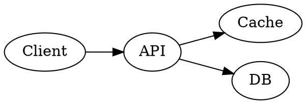
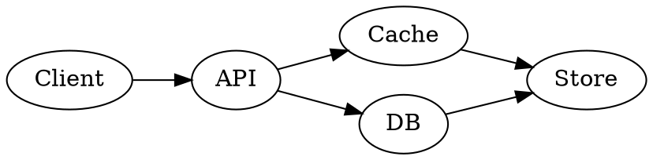

:: title

<logo.png>

---

:: include : intro

---

:: content
# Content types
refract renders several block types out of the box:

- text paragraphs
- bullet lists
  - including sub-bullets
- fenced code blocks
- image includes

---

# Code
```kotlin
fun greet(name: String) {
    println("Hello, $name")
}
```

---

# JSON
```json
{
  "type": "text",
  "value": "Hello",
  "fontSize": 24,
  "bold": true
}
```

```json
{
  "header": { "width": 1600, "height": 900 },
  "root": {
    "type": "box",
    "horizontalAlignment": "center",
    "verticalAlignment": "center",
    "modifiers": ["fillMaxWidth", { "background": "#FF223344" }, { "padding": 40.0 }],
    "children": [
      { "type": "text", "value": "Spliced-in RemoteCompose JSON", "fontSize": 40.0, "color": "#FFFFD54F" }
    ]
  }
}
```

---

# A graph


---

# A graph


---

# An embedded running .rc
<widget.rc>

---

# An image
<logo.png>

---

# A JSON include
<card.json>

---

:: content [2:3]
# Two panes (2:3)

Text on the left with a couple of points:
- first point
- second point

+++

<logo.png>

---

:: [1:1:1]
# Three panes (1:1:1)

Pane one text.

+++

- pane two
- bullets

+++

<logo.png>
